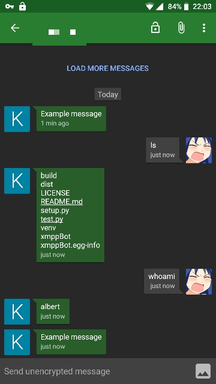

# xmppy


 

Python module for receiving and sending message using XMPP protocol.

Repos: [GitHub](https://github.com/aszadzinski/xmppy.git) [GitLab](https://gitlab.com/aszadzinski/xmppBot)

---

## Table of Contents

- [Installation](#Installation)
- [Usage](#Usage)
	- [Sending and receiving messages](Sending-and-receiving-messages)
		- [Example 1](#example-1)
		- [Example 2](#example-2)
		- [Example 3](#example-3)
	- [Data input](#Data-input)
	- [Console script](#Console-script)
	- [Encryption](#Encryption)
		- [GPG](#GPG)
		- [OMEMO](#OMEMO)
- [Todo](#Todo)

---

## Installation


### From source

``` python3 setup.py install```

**Depedencies:**

- sleekxmpp
- python-gnupg

### Using pip

`pip install xmppy`

or using .whl from [releases](https://github.com/aszadzinski/xmppy/releases):

`pip install xmppy-XXX.whl`

### AUR (TODO)

`makepkg xmppy`

## Usage

### Sending and receiving messages

#### example 1

(using classmethod)

```python
import xmppy.Messenger as xb
import subprocess as sp

def monitor():
	return "Example message"

def reply(msg):
	return sp.check_output(msg, shell=True).decode()

#send monitor() every 60 seconds and keep receiving reply()
Client = xb.Client.initialize("jabber_id@examp.le", "password",
				"send_to@examp.le", monitor, reply, freq=60)
 ```


#### example 2

(only sending messages)

 ```python
#send one message (for looping add freq param)
Client = xb.Client.sendMessage("jabber_id@examp.le", "password",
 						"send_to@examp.le", monitor)
```

#### example 3

(only receiving messages)

  ```python
  Client = xb.Client.receiveMessage("jabber_id@examp.le", "password", reply)
   ```

---

### Data input

Instead od entering data as parameters `xmppy.Client("jid","pass","recipient"...)` you can use .ini file:

```bash
#example.ini
[configfile]
jid = jid@examp.le
password = qwerty123
# recipient input is optional.
# In order to use entry below you should mark recipient as None in Client constructor
# i.e. xmppy.Client("file", "example.ini", None, ...) Otherwise, this input will be ignored.
recipient = rece@examp.le
```

and change function call from `.Client("jid@examp.le", "password", "recipient@examp.le", ...)`  to `.Client("file", "<.ini file>", <None or recipient@examp.le>, ...)`. Feature works with all calls from examples (1,2,3).

### Console script

`xmppy -j <Jabber ID> -p <password> -t <recipient> -m <message>`

---

### Encryption

#### GPG

(in progress...)

```python
Client = xb.Client.initialize("jabber_id@examp.le", "password",
				"send_to@examp.le", monitor, reply, freq=60, wait=True)
#temporarily doesn't support signing and receiving encrypted messages TODO!
Client.enableGPG("UID", "gnupghome_dir")

Client.run(wait=False)
```

#### OMEMO

TODO!
