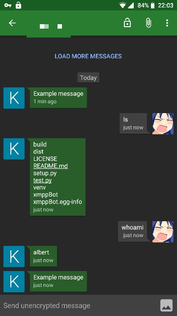

# XmppBot

Python module for receiving and sending massage using XMPP protocol

## Installation

``` python3 setup.py install```

## Usage

### Module

#### example 1 (using classmethod)

```python
import xmppBot.Messenger as xb
import subprocess as sp

def monitor():
	return "Example message"

def reply(msg):
	return sp.check_output(msg, shell=True)

#send monitor() every 60 seconds and keep receiving reply()
bot = xb.Bot.initialize("jabber_id@examp.le", "password",
				"send_to@examp.le", monitor, reply, freq=60)
 ```


#### example 2 (only sending messages)

 ```python
#send one message (for looping add freq param)
bot = xb.Bot.sendMessage("jabber_id@examp.le", "password",
 						"send_to@examp.le", monitor)
```

#### example 3 (only receiving messages)

  ```python
  bot = xb.Bot.receiveMessage("jabber_id@examp.le", "password", reply)
   ```

---

 ### Console script

`xmppBot -j <Jabber ID> -p <password> -t <recipient> -m <message>`

---

## Encryption

### GPG (in progress...)

```python
bot = xb.Bot.initialize("jabber_id@examp.le", "password",
				"send_to@examp.le", monitor, reply, freq=60, wait=True)
#temporarily doesn't support signing and receiving encrypted messages TODO!
bot.enableGPG("UID", "gnupghome_dir")

bot.run(wait=False)
```

### OMEMO

TODO!
